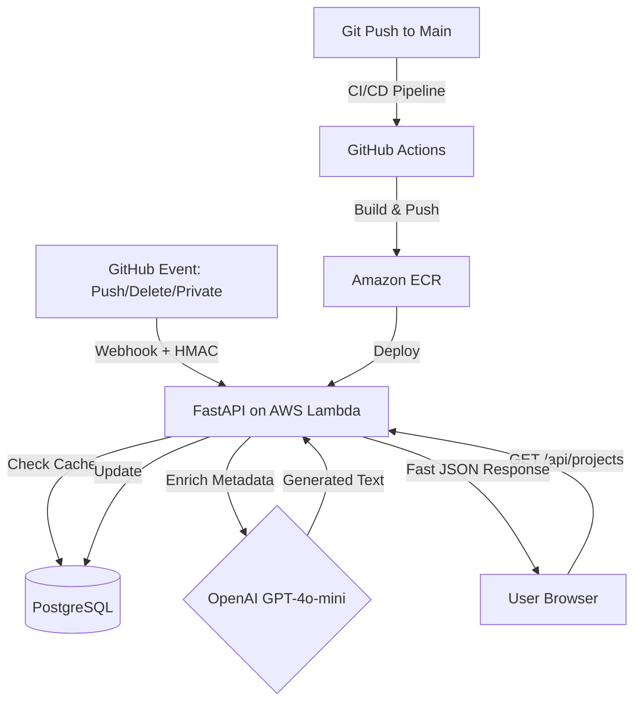

# AI-Powered Portfolio Engine 🚀

A high-performance, event-driven system that synchronizes GitHub data in real-time. This project demonstrates advanced full-stack engineering, secure webhook integration, and automated AI content generation using a modern distributed cloud architecture.

---

## 🏗 System Architecture

I designed this project as an Event-Driven System. To ensure a high-performance user experience, the frontend is decoupled from the GitHub API. Instead of slow, real-time fetching from external services, data is pushed to a backend cache via secure webhooks and served via a serverless AWS infrastructure.



## 🛠 Tech Stack
- **Frontend:** React + Vite (hosted on AWS Amplify)
- **Backend:** FastAPI (Serverless AWS Lambda via Mangum)
- **Containerization:** Docker (Images stored in Amazon ECR)
- **CI/CD: GitHub Actions** (Automated build, tag, push, and deploy)
- **Database:** PostgreSQL (Neon.tech)
- **AI Integration:** OpenAI API for automated project descriptions
- **Security:** HMAC SHA-256 signature verification for secure communications

## 🛣 API Documentation
The backend provides interactive Swagger documentation (OpenAPI) accessible at:
`https://spzm0j53b9.execute-api.us-east-2.amazonaws.com/default/portfolio-backend-api/docs`.

| Endpoint | Method | Description |
| :--- | :--- | :--- |
| `/api/projects` | `GET` | Fetches synchronized projects directly from the PostgreSQL database. |
| `/api/sync-github` | `POST` | Manually triggers a full synchronization cycle with the GitHub API. |
| `/api/github-webhook` | `POST` | Secure endpoint for real-time push, delete, and privacy events. |


## 🚀 Key Engineering Achievements
- **Serverless Migration:** Successfully migrated the backend from Render to AWS Lambda with ECR, reducing costs and improving scalability.

- **Full CI/CD Automation:** Implemented a sophisticated GitHub Actions pipeline that automates the Docker build-and-push process to Amazon ECR, followed by a seamless Lambda code update.

- **Monorepo Management:** Optimized the deployment workflow to only trigger backend builds when changes occur in the /backend directory, saving build time and resources.

- **Decoupled Architecture:** Utilized a database-backed cache to eliminate external API latency, improving project load times.

- **Security-First Design:** Implemented HMAC signature verification to protect backend integrity against unauthorized payloads and managed sensitive AWS credentials via GitHub Secrets.

```Plaintext

.
├── .github/workflows/
│   └── deploy.yml          # CI/CD Automation script
├── frontend/               # React application (AWS Amplify)
└── backend/                # FastAPI application (AWS Lambda)
    ├── Dockerfile          # Container configuration
    ├── main.py             # Server logic & routing
    ├── database.py         # SQLAlchemy & PostgreSQL setup
    └── requirements.txt    # Python dependencies