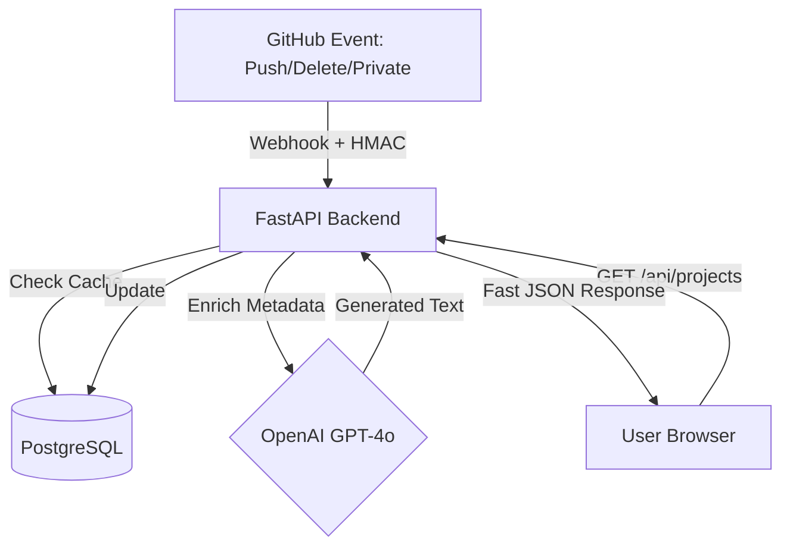

# AI-Powered Portfolio Engine 🚀

A high-performance, event-driven system that synchronizes GitHub data in real-time. This project demonstrates advanced full-stack engineering, secure webhook integration, and automated AI content generation using a modern distributed architecture.

---

## 🏗 System Architecture

I designed this project to be an **Event-Driven System**. To ensure a high-performance user experience, the frontend is decoupled from the GitHub API. Instead of slow, real-time fetching from external services, data is pushed to a backend cache via secure webhooks.

The backend provides interactive documentation at
`https://portfolio-website-98ei.onrender.com/docs`.

| Endpoint | Method | Description |
| :--- | :--- | :--- |
| `/api/projects` | `GET` | Fetches synchronized projects directly from the PostgreSQL database. |
| `/api/sync-github` | `POST` | Manually triggers a full synchronization cycle with the GitHub API. |
| `/api/github-webhook` | `POST` | Secure endpoint for real-time push, delete, and privacy events. |

## 🛠 Tech Stack
- **Frontend:** React + Vite (hosted on AWS Amplify)
- **Backend:** FastAPI (hosted on Render.com)
- **Database:** PostgreSQL (Neon.tech)
- **AI Integration:** OpenAI API for automated project descriptions
- **Security:** HMAC SHA-256 signature verification for secure communications

## 🚀 Key Engineering Achievements
- **Decoupled Architecture:** Migrated from direct API calls to a database-backed cache, improving project load times significantly.
- **Security-First Design:** Implemented HMAC signature verification to protect backend integrity against unauthorized payloads.
- **Event-Driven Automation:** Configured webhooks to handle the full repository lifecycle (push, delete, privatize, publicize).

💻 How to Run Locally
1. Clone the Repository
Bash

git clone [https://github.com/sajad42/portfolio-website.git](https://github.com/sajad42/portfolio-website.git)
cd portfolio-website
2. Backend Setup
Create a .env file in the /backend folder with your keys:

Bash

DATABASE_URL=your_postgresql_url
OPENAI_API_KEY=your_openai_key
GITHUB_WEBHOOK_SECRET=your_secret
Run the server:

Bash

cd backend
pip install -r requirements.txt
uvicorn main:app --reload
3. Frontend Setup
Create a .env file in the /frontend folder:

Bash

VITE_API_URL=http://localhost:8000
Run the app:

Bash

cd frontend
npm install
npm run dev
🔗 Live Links
Portfolio UI: https://main.d3a6cq397zfehj.amplifyapp.com/

API Documentation: https://portfolio-website-98ei.onrender.com/docs
