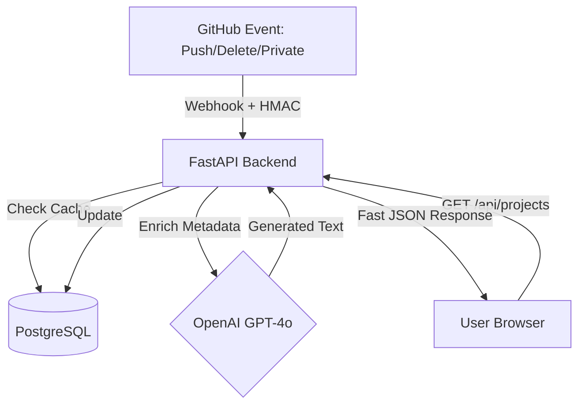

# AI-Powered Portfolio Engine 🚀

A high-performance, event-driven system that synchronizes GitHub data in real-time. This project demonstrates advanced full-stack engineering, secure webhook integration, and automated AI content generation using a modern distributed architecture.

---

## 🏗 System Architecture

I designed this project to be an **Event-Driven System**. To ensure a high-performance user experience, the frontend is decoupled from the GitHub API. Instead of slow, real-time fetching from external services, data is pushed to a backend cache via secure webhooks.



---

### **Step 4: Document the Endpoints**
Explain the routes you built in `main.py` so recruiters know how to interact with your API.

```markdown
The backend provides interactive documentation at `https://portfolio-website-98ei.onrender.com/docs`.

| Endpoint | Method | Description |
| :--- | :--- | :--- |
| `/api/projects` | `GET` | Fetches synchronized projects directly from the PostgreSQL database. |
| `/api/sync-github` | `POST` | Manually triggers a full synchronization cycle with the GitHub API. |
| `/api/github-webhook` | `POST` | Secure endpoint for real-time push, delete, and privacy events. |


🚀 Key Engineering Achievements
Real-Time Data Pipeline: Implemented GitHub Webhooks to automate the full repository lifecycle, synchronizing stars, languages, and visibility status instantly.

Security-First Architecture: Developed a custom HMAC SHA-256 signature verification layer to ensure backend integrity and protect against unauthorized payloads.

AI-Automated Documentation: Integrated the OpenAI API to dynamically generate professional project descriptions, reducing manual documentation overhead.

Performance Optimization: Migrated from direct API polling to a PostgreSQL (Neon) caching layer, reducing project load times significantly.
